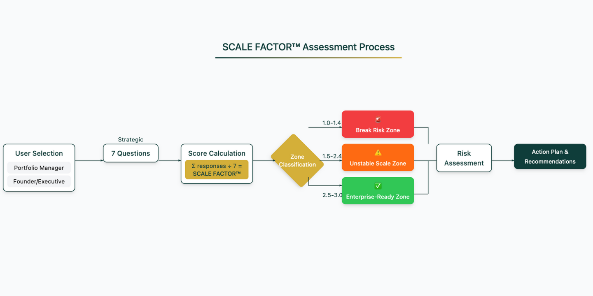

# SCALE FACTOR™ Assessment Methodology

Technical showcase of the SCALE FACTOR™ scoring framework - a proprietary system for measuring AI infrastructure readiness across 7 critical dimensions.

🔗 **[Take the Live Assessment](https://scalefactor.nadis.ai)**

## What is SCALE FACTOR™?

SCALE FACTOR™ is a diagnostic framework that evaluates organizations' ability to scale with AI infrastructure. It measures readiness across five key dimensions:

- **S**ystems Coherence - Integration and alignment of AI tools
- **C**ustomer Experience Integrity - Maintaining quality during growth
- **A**I Strategy Alignment - Systematic approach to AI adoption
- **L**eadership Infrastructure - Organizational structure for AI delivery
- **E**nterprise Readiness - Financial and operational scaling capacity

## How It Works

The assessment flow:
1. **User Type Selection** → Portfolio Manager or Founder/Executive
2. **7 Strategic Questions** → Covering all SCALE dimensions
3. **Real-time Scoring** → Calculate SCALE FACTOR™ (1.0-3.0)
4. **Zone Classification** → Break Risk / Unstable / Enterprise-Ready
5. **Risk Assessment** → Calculate potential infrastructure failure costs
6. **Action Plan** → Immediate and strategic recommendations

## Scoring Zones

| SCALE FACTOR™ | Zone | Risk Level | What It Means |
|--------------|------|------------|---------------|
| 1.0 - 1.4 | 🚨 Break Risk | Critical | Infrastructure gaps threaten scaling ability |
| 1.5 - 2.4 | ⚠️ Unstable Scale | Moderate | Growth possible with optimization |
| 2.5 - 3.0 | ✅ Enterprise-Ready | Low | Prepared for aggressive scaling |

## Technical Implementation

- **Sample Questions**: [sample-questions.json](./sample-questions.json) - See the 7 strategic questions
- **Scoring Logic**: [scoring-logic.md](./scoring-logic.md) - Detailed algorithm and calculations
- **Live Assessment**: [scalefactor.nadis.ai](https://scalefactor.nadis.ai) - Full interactive experience

## Use Cases

- **VCs** - Evaluate portfolio company infrastructure maturity
- **Founders** - Identify scaling bottlenecks before they break
- **Consultants** - Baseline client readiness for transformation
- **Accelerators** - Screen applicants for program fit

## About

Created by [Ariana Abramson](https://linkedin.com/in/arianaabramson) at [Nadis Intelligence](https://nadis.ai)

Based on analysis of 200+ scaling organizations and their AI adoption patterns.

---

**© 2025 Nadis Intelligence. SCALE FACTOR™ is a trademark of Nadis Intelligence.**